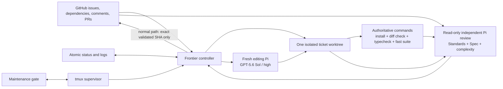
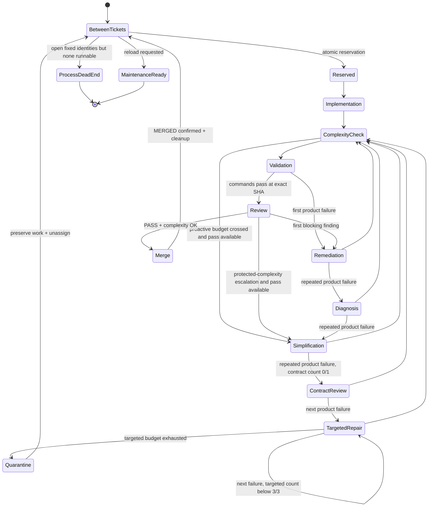

# Frontier implementation loop: architecture and operating lessons

This document explains the repository-local system that keeps implementation agents moving through the MDLM issue frontier. It covers the current architecture, the delivery and recovery policies encoded in it, the failures observed while implementing issues #84–#89, and the practices that keep the loop moving without trading away correctness.

For command-level operating instructions, see [frontier-loop.md](frontier-loop.md).

## Executive summary

The frontier loop is a deterministic, serial controller around probabilistic coding agents:

- GitHub issues define a fixed delivery scope and live dependency graph.
- One detached tmux supervisor keeps one runner alive.
- The runner reserves one dependency-safe ticket at a time.
- Each editing action receives a fresh GPT-5.6 Sol/high Pi process in an isolated worktree.
- Editing agents run focused checks and typecheck; the runner alone owns the bounded authoritative fast suite and independent review.
- Every Pi editing action and every editing/review attempt start are recorded durably before Pi starts, and validation/publication records exact commit identity.
- The normal publication path pushes and merges only the exact commit that passed commands and independent review.
- Failures advance through a finite, cumulative ticket-wide ladder: one contract review, three targeted repairs, then quarantine.
- Quarantine preserves failed work while allowing independent fixed-scope work to continue; an unrecoverable fixed-scope stall becomes terminal `process-dead-end`.
- Maintenance drains at a clean between-ticket boundary, updates the controller, and resumes under the same supervisor.

The central operating principle is:

> Protect correctness and irreversible boundaries, but do not make every possible improvement a release blocker.

That means active acceptance criteria, tests, regressions, and protected architectural invariants block publication. Refactoring preferences, module-depth opportunities, localized out-of-scope defects, and explicitly deferred sibling work do not.

## Scope and non-goals

The frontier loop is implementation infrastructure, not part of MDLM's product runtime. It does not add model execution, agent orchestration, or workflow semantics to the MDLM kernel. It is a repository-local delivery harness that edits code, validates exact Git commits, and publishes ordinary pull requests.

The first release remains deliberately serial:

- one active implementation ticket;
- one isolated implementation worktree;
- one editing Pi process at a time;
- one authoritative validation result per changed committed tip;
- one read-only independent review per exact evidence fingerprint; and
- one exact commit authorized for normal publication.

It is not a generic workflow engine, distributed job queue, parallel-agent scheduler, or configurable approval system.

## System context



The model is intentionally asymmetric. Agents propose repository changes, but deterministic code owns selection, state transitions, validation, publication, recovery, and cleanup.

## Process topology

There are three long-lived or repeated process layers:

1. **Detached tmux session** — keeps the system independent of an interactive terminal.
2. **Supervisor** — starts the runner, observes its exit, preserves state, retries failures, and performs safe reloads.
3. **Runner** — selects tickets and drives one ticket lifecycle at a time.

Short-lived child processes include:

- one editing Pi process for implementation, remediation, diagnosis, simplification, contract review, or targeted repair;
- one read-only Pi process for final independent review;
- one short-lived process-group runner around every editing and reviewing Pi invocation;
- Git, GitHub CLI, npm, TypeScript, and Vitest commands; and
- tmux and `shlock` operations used for supervision and maintenance arbitration.

The supervisor and runner are separate because they have different failure domains. A runner may terminate during a provider call, GitHub operation, validation command, or publication step. The supervisor remains available to restart it against durable state and the preserved worktree.

## Module map

| Module | Responsibility |
| --- | --- |
| `scripts/frontier-loop.mjs` | CLI, prerequisites, detached supervisor, scope snapshots, frontier selection, atomic state, top-level retries, status, health, stop, and reload coordination. |
| `scripts/frontier-ticket-runner.mjs` | Isolated worktree lifecycle, editing actions, validation/review state machine, PR publication, merge confirmation, and cleanup reconciliation. |
| `scripts/frontier-agent-runner.mjs` | Explicit model arguments, Pi process execution, validation commands, evidence construction, verdict parsing, and complexity statistics. |
| `scripts/frontier-prompts.mjs` | Shared editing policy, role-specific correction prompts, active-child scope, delivery-biased reviewer policy, and validation ownership. |
| `scripts/frontier-loop-core.mjs` | Pure state decisions and parsing: finite correction scheduling, terminal recognition, verdicts, complexity triggers, retry classification, and exact-head checks. |
| `scripts/frontier-failure-evidence.mjs` | Semantic failure normalization, stable fingerprints, and repeat-state transitions. |
| `scripts/frontier-process-group.mjs` | Synchronous deep interface over a detached Unix process group with TERM/grace/KILL timeout cleanup. |
| `scripts/frontier-issue-contract.mjs` | Parent and blocker parsing, fixed identity snapshots, quarantine-aware dependency-safe serial selection, and priority-to-backlog fallback. |
| `scripts/frontier-maintenance.mjs` | Crash-recoverable arbitration among reload, stop, ticket reservation, and safe-boundary acknowledgement. |
| `scripts/frontier-command.mjs` | Synchronous commands with finite timeouts and narrowly classified GitHub/infrastructure retry. |
| `scripts/frontier-time.mjs` | Shared in-process sleep used without creating stray external sleep processes. |
| `scripts/frontier-loop-tests.mjs` | Focused executable tests for selection, state transitions, model pinning, prompt policy, maintenance races, validation recovery, and publication identity. |

`frontier-loop.mjs` and `frontier-ticket-runner.mjs` are currently the orchestration coordinators. Most policies that can be made pure live in `frontier-loop-core.mjs`; external side effects remain in the coordinators.

## Delivery scope: fixed identity, live truth

At first start, the loop snapshots two identity sets:

1. every issue whose explicit `## Parent` section references the configured parent, currently #83; and
2. the older open `ready-for-agent` backlog eligible at that moment.

The identities remain fixed for the run. New children, labels, and unrelated reopened issues cannot silently expand autonomous authority.

Truth that can legitimately change remains live:

- issue state;
- blocker state;
- assignees;
- issue body and acceptance criteria;
- comments, including auditable contract clarifications;
- pull request state and head SHA; and
- remote checks.

The runner prefers the priority-map snapshot and chooses the lowest-numbered issue that is open, unassigned, not quarantined, and has every blocker closed. Native GitHub dependencies are preferred; an explicit `## Blocked by` section is the fallback. If no priority identity is runnable, selection may fall through to the lowest independently ready identity from the fixed backlog snapshot. Quarantined identities are excluded only as candidates: because their GitHub issues remain open, they continue to block dependents. No fallback query can add new identities.

This split—fixed authority, live evidence—is important. A fully live query can absorb unintended work. A fully frozen snapshot misses corrected contracts and newly closed blockers.

## Ticket lifecycle



### 1. Reservation and isolation

Reservation is written durably before leaving the between-ticket boundary. The runner then:

- fetches the current default branch;
- creates `agent/issue-<number>-<timestamp>` from exact `origin/main`;
- creates `artifacts/frontier-loop-83/worktrees/issue-<number>`; and
- assigns the issue to the authenticated operator.

Once branch and worktree identities have been written to status, a restart recognizes the current issue and existing worktree instead of creating a second branch. There is currently a narrow crash window after Git creates the worktree but before those identities are persisted; restart then rejects the directory as unrecognized and needs operator cleanup. Reservation of the issue is durable across that window, but worktree creation is not yet a fully recoverable transaction.

### 2. Editing action

Before Pi starts, the runner persists a typed pending action:

- `implementation`;
- `remediation`;
- `diagnosis`;
- `simplification`;
- `contract-review`; or
- `targeted-repair`.

A contract-review count is consumed in the same atomic state write that schedules its pending action, and it can never exceed one for the whole ticket. Targeted-repair counts use the same boundary and can never exceed three. Recovery sees the existing pending action and resumes it without changing either count. Immediately before each editing or review Pi invocation, the controller also persists an attempt-start identity. That identity combines with the action kind to deduplicate an observed timeout across crash/resume.

The fresh Pi process is explicitly pinned to:

```text
openai-codex/gpt-5.6-sol
thinking: high
```

Both editing and read-only reviewer Pi processes are started without shell interpolation in their own Unix session/process group. The runner enforces the existing timeout by signaling the entire group with SIGTERM, waiting a short grace period, then sending SIGKILL and waiting for the group to disappear. The agent-runner boundary converts the deterministic timeout status into a typed timeout carrying action kind, durable attempt-start identity, log, and evidence. The ticket runner persists that occurrence and a separate ticket-wide count before returning control. One fresh retry is allowed; a second timeout quarantines as `agent-infrastructure-timeout`. Thus a Pi-launched Vitest, compiler, or build descendant cannot survive merely because Pi itself timed out, and the controller cannot restart timeout batches forever.

Editing sessions are non-persistent. They receive the issue, parent, repository guidance, branch history, current worktree, correction log, and role-specific instructions.

The common editing policy says:

- the active child acceptance criteria are the current delivery boundary;
- parent invariants remain binding;
- explicitly deferred sibling work remains deferred;
- use focused checks and typecheck while editing;
- do not run the full suite;
- do not invoke nested Pi or code-review agents;
- commit completed work with the issue number; and
- do not push, publish, merge, or close the issue.

This explicitly overrides `/skill:implement`'s ordinary final full-suite and code-review steps. Without the override, editor and orchestrator both performed the same expensive work.

### 3. Progress detection

Before and after an editing action, the runner fingerprints:

- committed `HEAD`;
- tracked and untracked worktree bytes; and
- live active-issue and parent body/comments.

A pass is not considered a no-op merely because it produced no commit. An uncommitted edit or auditable issue comment is progress. A true no-op advances the finite correction ladder while preserving exact validation/review evidence cached for the unchanged SHA and evidence fingerprint. If the no-op was a targeted repair, its already-persisted count remains consumed.

### 4. Proactive complexity check

The runner computes branch-wide statistics against `origin/main`:

- changed files;
- added plus deleted lines; and
- changed paths under `src/` or `.lifecycle/`.

Defaults are 24 files, 1,800 lines, and 12 changed paths under `src/` or `.lifecycle/`. Crossing a threshold requests the one available simplification pass; it does not itself prove the implementation is wrong.

These are coarse tripwires, not design metrics. The reviewer is instructed not to fail a working tracer bullet solely because it is broad or could be refactored further.

### 5. Authoritative command validation

For each changed committed tip, the runner—not the editor—runs:

1. `npm ci --ignore-scripts`;
2. `git diff --check origin/<base>...HEAD`;
3. `npm run typecheck`; and
4. `npm test`, the PR-authority gate for classified package/evaluator, static contract, representative public-boundary, `mdlm-pi`, and controller tests.

The PR gate has a 600,000 ms bound. When a diff changes a release-only public boundary, validation names that manifest file with `npm test -- --root-test=test/<file>.test.ts`. The rolling integration lane runs `npm run test:release` once on the final integrated candidate. That 2,400,000 ms release and demo gate includes every PR file plus all retained compiled-public and complete-lifecycle routes.

Validation is accepted only when:

- the branch has commits beyond the base;
- the worktree is clean;
- every command completes successfully;
- validation does not mutate the branch; and
- `HEAD` remains identical.

The state distinguishes:

- validation in flight;
- a completed attempt;
- a completed pass; and
- an interrupted or unconfirmed attempt.

A completed result is reusable only for the identical committed tip. An interrupted attempt is retried. A completed failure at an unchanged tip advances correction rather than repeatedly burning the same full-suite time.

### 6. Independent review

After commands pass, the runner constructs a read-only evidence packet containing:

- exact branch commits;
- complete active issue body and comments;
- complete parent issue body and comments; and
- exact diff from `origin/main` to `HEAD`.

The evidence bytes are hashed. Review reuse requires both the same SHA and the same evidence fingerprint, so a live contract/comment change invalidates stale review without necessarily invalidating command validation.

The reviewer has only read/search tools and cannot edit. It reports two axes:

- **Standards** — repository instructions, glossary, ADRs, module depth, and material smells;
- **Spec** — every active-ticket criterion, incorrect behavior, missing behavior, negative scope, regressions, and scope creep.

The output is machine-accepted only when exactly one complexity verdict and one validation verdict are the final two lines:

```text
COMPLEXITY: OK | ESCALATE
VALIDATION: PASS | FAIL
```

Malformed reviewer output retries the reviewer without rerunning already-passing commands or changing product code.

### 7. Exact-SHA publication

Publication is allowed only when the local `HEAD` equals the persisted validated head. The runner:

- pushes the ticket branch;
- reopens a previously closed, unmerged PR if recovery finds one;
- creates or reuses the PR;
- confirms its remote head equals the validated SHA;
- waits for registered remote checks when workflows exist;
- checks the remote head again;
- merges with `--match-head-commit`;
- polls until GitHub reports `MERGED`;
- deletes the remote branch;
- waits for the PR's closing reference to close the issue, or closes it explicitly after confirmed merge; and
- removes the local worktree and branch.

A PR URL, a successful merge command, or a closed issue is not treated as publication proof. Confirmed GitHub `MERGED` state is the boundary. The normal open-PR path enforces exact-SHA identity before checks and again before merge. Recovery of a PR that is already merged also requires its recorded head SHA to equal the persisted validated SHA before issue closure or cleanup.

## Durable state and at-least-once recovery

Operational state lives under ignored `artifacts/frontier-loop-83/` and is replaced atomically through temporary-file rename.

Important state includes:

- fixed priority and backlog issue identities;
- current issue, branch, and worktree;
- phase and typed pending action;
- PR number;
- command in-flight, attempted, and validated heads;
- independently reviewed head and evidence fingerprint;
- final publication-validated head;
- remediation use and diagnostic/design/contract/targeted-repair counts;
- ticket-wide agent-timeout count, exact occurrence identities, and current attempt-start identity;
- current and previous product-failure fingerprints, repeat count, and latest failure-evidence path;
- quarantine records with preserved branches/worktrees and all ticket counters;
- complexity-reviewed and no-progress heads;
- supervisor restart count; and
- last error.

Recovery is deliberately at-least-once for editing actions. Scheduling and product-budget consumption happen in one atomic write before Pi starts. Each concrete Pi invocation then receives a durable attempt-start identity. If Pi finished but the controller crashed before atomically acknowledging completion, the supervisor may start a fresh Pi in the same action mode against the preserved commits and uncommitted bytes, but it does not consume another product count. If the timeout occurrence was already persisted, action kind plus attempt-start identity prevents recounting it after a crash. Once an action is acknowledged, pending state advances durably to validation so a crash cannot accidentally launch a new implementation pass. A timed-out reviewer retains exact command-validation identity, so its one fresh retry resumes at review. Safe reload migrates legacy schema-3 states that already exceeded one contract review away from another broad action and back to exact validation, after which only the finite targeted ladder is available; historical counts remain preserved. Migration never infers a missing publication `validatedHead` from GitHub or weaker local review state.

Publication recovery is reconciliation-based. If a PR merged but issue closure or cleanup was interrupted, restart confirms PR identity, `MERGED` state, and equality between the PR head and persisted validated SHA before closing the issue and deleting work. It does not republish product bytes.

## Failure taxonomy

The loop separates failures that require different responses.

| Failure class | Response |
| --- | --- |
| Product command or valid independent-review failure | Persist exact latest evidence/fingerprint, then advance the finite ticket-wide correction ladder. |
| Malformed reviewer verdict | Retry read-only review only; consume no product budget and create no quarantine evidence. |
| Transient Pi/provider failure | Retry the same typed agent action in place; consume no product budget and create no product-failure evidence. |
| First ticket-wide Pi timeout | TERM then KILL the complete process group, persist the exact occurrence and timeout count, then allow one fresh retry of the same editing/review action; consume no product budget. |
| Second ticket-wide Pi timeout | Quarantine as `agent-infrastructure-timeout`, preserve branch/worktree and timeout log/evidence, remove assignment, and continue independent fixed scope; create no product fingerprint/finding. |
| Transient GitHub/network failure | Retry commands with backoff or keep publication in a same-runner retry state; consume no product budget. |
| Observed failing remote check | Persist the exact check output and enter the same finite product-correction ladder. |
| Missing/unconfirmable remote check state | Retry publication without editing product code. |
| Targeted-repair budget exhausted | Quarantine the open ticket and preserve all work/evidence; continue another independent fixed identity if available. |
| No runnable fixed identity while open work remains | Enter terminal `process-dead-end`; supervisor does not restart. |
| Merge command returned but merge unconfirmed | Retry publication reconciliation. |
| Runner process exits unexpectedly | Supervisor preserves state/worktree and restarts after 30 seconds. |
| Explicit stop | Record `STOP`, interrupt tmux, and terminate the session. |

This classification prevents infrastructure noise from consuming product-correction budgets and prevents product defects from being retried forever as if they were network flakes.

## Cumulative correction ladder

A ticket gets:

1. its initial implementation;
2. one broad remediation after first failed validation;
3. one root-cause diagnosis after a repeated failure;
4. one design simplification after another failure or proactive complexity trigger;
5. exactly zero or one broad contract review once ordinary correction passes are exhausted;
6. up to three targeted repairs; and
7. quarantine if the signal remains blocking.

The budgets are cumulative for the whole ticket. Contract review does not reset any earlier history and can never self-loop. Remote-check corrections use the same counters. Exact no-progress passes and repeated fingerprints consume the targeted action already scheduled for them.

Each mode has a distinct purpose:

- **Remediation:** address concrete command or review findings at the active ticket seam.
- **Diagnosis:** build a tight reproduction, rank falsifiable causes, and repair root cause rather than layering patches.
- **Simplification:** delete machinery, deepen a seam, or replace an overgrown design while retaining active requirements.
- **Contract review:** once only, first seek a substantially smaller implementation of the unchanged contract; only then record a smaller user-goal-preserving clarification.
- **Targeted repair:** use diagnosing-bugs against only the latest exact failure artifact, reproduce the narrow signal, make the smallest root-cause edit, run focused tests/typecheck, commit, and neither change contracts nor broadly redesign.
- **Quarantine:** leave issue, PR (if any), branch, and worktree unmerged and open; post one marker-backed auditable issue comment, remove only the orchestrator's assignment, append a durable record, clear the active slot, and continue fixed scope.

A contract clarification must be an issue comment that states:

- retained behavior;
- intentionally given-up behavior; and
- why the smaller behavior still serves the parent goal.

It cannot waive atomic Scenario publication, one canonical writer, package neutrality, harness neutrality, independent judgment, tests, or independent review.

### Failure evidence and fingerprints

Every completed product failure replaces one per-ticket artifact with only the latest command identity, exact failed command or read-only reviewer output, stable fingerprint, and repeated flag. It does not use the entire historical issue log as primary repair evidence. Fingerprinting strips ANSI controls, wall-clock timestamps, durations, and temporary-root/run noise while retaining semantic lines including failed test names, error and assertion text, source locations, reviewer blocking findings, verdicts, and command identity. State records current and previous fingerprints plus the consecutive repeat count. A no-progress pass reuses the exact artifact, marks it repeated, and advances the finite budget.

Infrastructure and provider failures never enter the product-failure evidence path. Agent timeouts have their own durable occurrence identity, count, action, evidence, and log. That separation prevents an HTTP outage, malformed verdict, missing check registration, connection reset, or Pi timeout from consuming product corrections or manufacturing a product fingerprint/finding.

## Quarantine and terminal convergence

Quarantine is a terminal ticket disposition of the orchestrator, not a claim that implementation passed. It has two explicit classes: `product-correction-exhausted`, with product fingerprint/evidence, and `agent-infrastructure-timeout`, with timeout action/evidence/log and no product fingerprint. The ticket remains open, preserving its dependency-blocker role. The branch and worktree are not deleted, the PR is not merged, and exact class-appropriate counters/evidence are copied into both status and the durable quarantine record. A marker in the issue comment makes comment publication idempotent across crashes; durable record append and active-state clearing are likewise reconciled on resume.

After quarantine, serial selection first tries runnable non-quarantined priority identities, then independently ready non-quarantined backlog identities from the original snapshot. If neither pool has a runnable identity and some fixed identity remains open—whether quarantined, dependency-blocked, or assigned—the controller records `process-dead-end` and exits. The supervisor recognizes it as terminal and health reports nonzero. There is deliberately no attended/human-stop state. `complete` is reserved for the stronger fact that every fixed identity is closed.

## Delivery-biased shipping gate

### Blocking findings

A ticket does not ship with:

- a failed active-ticket acceptance criterion;
- a failing typecheck or test;
- a concrete correctness or safety defect in delivered behavior;
- a regression of already delivered behavior;
- dirty or uncommitted publication bytes;
- a mismatch among local, reviewed, PR, and merge SHAs;
- invalid atomic publication behavior;
- more than one canonical writer;
- package- or harness-specific kernel behavior;
- suppression or rewriting of independent judgment; or
- an unaudited behavioral contract change.

### Non-blocking follow-ups

A ticket may ship with clearly identified:

- module-depth improvements;
- cleanup opportunities;
- localized defects outside active scope;
- performance or fault-injection hardening outside active acceptance;
- explicitly deferred sibling behavior;
- final interface contraction assigned to a later tracer; and
- a broad but bounded implementation that can be improved after use.

### Decision rule

Ask three questions:

1. **Does the active ticket work at its public seam?**
2. **Does it preserve the protected invariants and prior behavior?**
3. **Are remaining findings improvements rather than defects in what is being delivered now?**

If all three answers are yes, ship. Do not turn “could be cleaner” into “cannot be used.”

## Safe maintenance and reload

Maintenance must not interrupt an active ticket. `frontier:reload` writes a durable request and returns immediately.

A crash-recoverable `shlock` gate atomically arbitrates among:

- reserving the next ticket;
- draining for reload;
- explicit stop;
- acknowledging a reload; and
- cancellation.

The runner completes validation, review, publication, and cleanup for its reserved ticket. Only when current issue, branch, and worktree are all cleared does it enter `maintenance-ready`. The existing supervisor then:

1. verifies the clean control checkout;
2. fetches and fast-forwards to `origin/main`;
3. records `supervisor-reloading`;
4. starts the new runner;
5. has the fresh runner atomically acknowledge the request; and
6. resumes frontier selection.

This mechanism was essential when the old runner itself caused the slowdown. Waiting for a natural boundary without a durable reload request created a circular dependency: the fix was needed to reach the boundary efficiently. Safe drain-and-reload broke that cycle without discarding ticket work.

## Observability

The operator has five primary views:

```sh
npm run frontier:status
npm run frontier:health
npm run frontier:watch
npm run frontier:attach
tail -F artifacts/frontier-loop-83/issue-<number>.log
```

`status` reports phase, pending action, issue, branch, worktree, PR, correction counts, maintenance, progress, next item, status age, issue-log age, and recent log output.

Health is zero only when the tmux supervisor is alive or the run is truly complete. `process-dead-end` is intentionally unhealthy/nonzero even though it is a recognized terminal outcome. Status lists correction caps, current/repeated fingerprints, evidence paths, every quarantine, and preserved worktrees. Outside a terminal outcome, forward progress still requires examining:

- status age;
- issue-log activity age;
- live child process and CPU activity;
- new commits or worktree changes;
- validation output; and
- issue/PR state.

A long-running Pi process with fresh log or test activity is different from a stale process with no state, log, Git, or GitHub change.

## What we learned from #84–#89

The historical details below are operational observations, not reproducible benchmarks or guarantees. Their primary evidence is the ignored run log `artifacts/frontier-loop-83/runner.log`, the per-ticket logs `artifacts/frontier-loop-83/issue-<number>.log`, and merged GitHub PRs #108–#116. The logs are intentionally not committed because they contain ephemeral operational state; exact timings and test counts are included to explain the interventions rather than specify future behavior.

### 1. Complete issue bodies are review evidence, not optional context

Early review used `gh issue view --comments`, which omitted the authoritative issue body. Reviewers repeatedly failed correct work because they did not have the acceptance criteria. The evidence seam now fetches structured `number,title,body,comments` for both child and parent.

**Lesson:** do not ask a model to infer a contract from a title, comments, or branch diff. Give it the exact contract and test that the retrieval command preserves it.

### 2. Pin the model at every orchestrator-owned invocation

Ambient Pi configuration already selected GPT-5.6 Sol/high, but relying on ambient defaults made verification difficult and allowed manual sessions to drift. Agent arguments now explicitly set model and thinking level, with focused regression coverage.

**Lesson:** configuration that matters to auditability belongs in the invocation, not only in a user profile.

### 3. Active-child scope must outrank parent end-state pressure

Reviewers naturally compared early tracer bullets to the complete parent goal. That caused them to demand final contraction, sibling behavior, and parent-wide polish too early. The prompt now makes the active child the delivery boundary while retaining parent invariants.

The #87 review surfaced the useful staging distinction: `mdlm scenario submit` became the canonical normal writer before issue #104 completed the final public-interface contraction.

**Lesson:** staged delivery needs both a binding parent invariant and an explicit “not yet” boundary. Without both, review either permits architectural drift or blocks every intermediate tracer.

### 4. One owner must control each expensive quality gate

Editing agents were told to use `/skill:implement`, whose normal completion steps include full tests and code review. The orchestrator then repeated both. On process-heavy integration tests, concurrent or duplicated suites caused widespread timeout failures unrelated to product assertions.

The common editing prompt now explicitly overrides those skill defaults. Editors use focused tests and typecheck; the orchestrator performs one final suite and one independent review.

**Lesson:** “please avoid duplicate work” is weaker than assigning a single owner and explicitly overriding contradictory defaults.

### 5. Test contention can masquerade as product failure

During #87, the retained `issue-87.log` recorded 261 of 263 tests passing while two process-heavy tests exceeded their timeout by small margins. The diagnosis recorded redundant Assignment preparation and excessive child-process concurrency; after reusing preparation and limiting Vitest workers, the next authoritative run recorded 263/263 passing. These are observations from that run, not permanent suite-size expectations.

**Lesson:** classify timeout-only failures separately from semantic assertions, reproduce them narrowly, and measure contention before changing behavior or inflating limits.

### 6. Architecture review cannot treat every preference as a release blocker

#86 met its active acceptance criteria, but repeated module-depth recommendations caused more simplification cycles. The reviewer gate was changed so concrete defects and protected-invariant violations block, while refactoring preferences become non-blocking follow-ups.

**Lesson:** high standards improve delivery only when severity is explicit. A review system with only “perfect” and “fail” optimizes indefinitely.

### 7. Numeric complexity thresholds are tripwires, not goals

The #87 operational log recorded one pass reducing the branch from 1,802 to 1,799 changed lines. That satisfied the literal threshold without materially changing the design. Later contract work increased the branch again and, because correction counters reset, caused another simplification pass.

The counters are now cumulative. The threshold may request one design look, but line count alone does not reject a justified tracer.

**Lesson:** never let a proxy metric become the objective. Review the mechanism and boundary, not whether a diff is three lines under a number.

### 8. Correction budgets must be ticket-wide

The original contract-review transition reset remediation, diagnosis, simplification, and complexity-review history. The #87 state/log showed that it restarted a ladder it had already consumed. [PR #112](https://github.com/taylorrowser/mdlm/pull/112) changed those counters to remain cumulative.

**Lesson:** a bounded loop is not bounded if an escalation transition replenishes the budget.

### 9. No-op detection needs bytes and live contract evidence

Commit-only progress detection misses uncommitted fixes and issue comments. It can incorrectly escalate or skip review. The runner now fingerprints committed head, tracked/untracked bytes, active issue evidence, and parent evidence.

**Lesson:** define progress at the actual side-effect boundaries, not at one convenient proxy such as commit count.

### 10. Validation and review caches need different identities

Commands validate repository bytes at a committed SHA. Review validates those bytes against live issue and parent evidence. A comment can invalidate review without invalidating tests.

**Lesson:** cache by the identity of what was proven. SHA is enough for commands; review requires SHA plus evidence fingerprint.

### 11. Publication is a transaction with reconciliation

A merge command can succeed while the process dies before observing success, closing the issue, or deleting the worktree. The loop now confirms `MERGED`, records exact SHA identity, and reconciles partial cleanup on restart.

**Lesson:** do not model publication as “run command once.” Model desired external state and reconcile until it is proven.

### 12. Maintenance needs its own state machine

Immediate stop is appropriate for emergencies but conflicts with safe updates. A separate durable maintenance request allows the current ticket to finish while preventing the next reservation.

**Lesson:** “stop now” and “reload safely later” are different operator intents and need different mechanisms.

### 13. Throughput improved when policy became explicit

The early broad tracers experienced repeated review and correction cycles. #84 took multiple validations, two diagnoses, contract review, and further correction. #86 and #87 similarly exposed quality-gate and budget problems.

After the delivery-biased gate, cumulative budgets, and single-owner validation policy were installed, `runner.log` recorded:

- #88 implementing at 21:50 and merging at 22:51 after one remediation;
- #89 implementing at 22:52 and merging at 00:10 after one simplification and one remediation; and
- the loop moving directly to #90.

These wall-clock observations are not an SLA, and ticket scope differs, but the shape improved: fewer repeated phases and a clear path to publication.

### 14. A counted escalation is not bounded unless it has a terminal successor

Issues #95, #99, and #101 later exposed the remaining hole: broad contract review still had a self-loop. #101 reached `contractReviews=5`, and broad sessions repeatedly triggered roughly 27-minute suites while one stale assertion remained. Cumulative earlier counters prevented ladder reset but did not make the final mode convergent.

**Lesson:** every correction mode needs both a hard whole-ticket cap and an explicit successor. One broad contract review now leads only to evidence-scoped targeted repair, then quarantine.

### 15. Repair context should contract as uncertainty contracts

Repeated broad sessions received historical logs and rediscovered architecture after the failure had narrowed to one assertion. That encouraged redesign and expensive retesting rather than a small fix.

**Lesson:** after broad correction is spent, send only the latest exact red/reviewer signal, stable semantic identity, and repeat information. Require narrow reproduction and focused checks.

### 16. Timeout ownership includes descendants

A timed-out Pi left Vitest/MDLM descendants alive. Killing only the direct process made subsequent suites slower and could turn cleanup failure into misleading product failures.

**Lesson:** place every Pi in a dedicated process group and make timeout completion mean the whole group has received TERM, grace, and KILL. Then classify the boundary result explicitly and bound controller retries durably; descendant cleanup alone does not prove convergence. Test cleanup with a real child/grandchild tree and state transitions with editing/reviewer timeout cases.

## Practices that keep agents moving

### Before starting

- Break work into dependency-wired vertical slices with executable acceptance criteria.
- Name explicitly deferred sibling and final-contraction work.
- Keep the control checkout clean and pushed.
- Snapshot autonomous scope once.
- Confirm model, authentication, tmux, Git, npm, and `shlock` prerequisites.

### During implementation

- Give each action a fresh context and one exact role.
- Preserve the existing worktree across recovery.
- Run focused tests at the public seam, not broad speculative coverage.
- Persist the typed action before starting Pi.
- Treat commits, uncommitted bytes, and contract comments as progress.
- Keep publication and issue closure under deterministic controller ownership.

### During validation

- Run the authoritative fast suite once at a clean committed tip.
- Keep one representative compiled-public transaction per major kernel boundary and prove route permutations at package/evaluator seams; run the single bounded gate before publication.
- Never run independent review before commands pass.
- Give review complete issue/parent evidence and the exact diff.
- Require explicit machine-readable verdicts.
- Separate blockers from follow-ups.
- Reuse results only when their exact identities still match.

### When work starts looping

1. Determine whether the process is active or stale using status/log age and child processes.
2. Identify whether failure is semantic, timeout/contention, provider, GitHub, publication, or review-contract disagreement.
3. Reproduce the narrow failure before another broad edit.
4. Spend at most the ticket's remaining correction pass for that mode.
5. Prefer deleting machinery or reducing scope over adding recovery knobs.
6. Spend the single broad contract review at most once; after it, use only the latest failure artifact for targeted repair.
7. Quarantine after the third targeted repair rather than restarting, throwing, pretending to pass, or reopening a broad mode.
8. Do not restart correction budgets.

### Before shipping

- Confirm the worktree is clean.
- Confirm command-validated SHA, reviewed SHA, local SHA, and PR head match.
- Confirm remaining findings are truly non-blocking.
- Confirm remote checks or explicitly authoritative local validation.
- Confirm GitHub reports `MERGED` before closing or cleaning up.

## Operator intervention guide

| Observation | Interpretation | Recommended action |
| --- | --- | --- |
| Fresh log activity and active Pi/test process | Work is progressing. | Wait; avoid competing suites or manual edits. |
| Long Pi action but new commits or focused tests appear | Broad action is still productive. | Monitor through its bounded phase. |
| Fast suite active once at final tip | Expected authoritative validation. | Do not launch another suite. |
| Explicit affected journey active | Expected scoped lifecycle evidence. | Do not launch the same journey again. |
| Timeout-only failures across process-heavy tests | Likely contention/performance issue. | Let diagnosis reproduce narrowly; inspect worker concurrency. |
| Repeated review of unchanged SHA/evidence | Cache or no-op bug. | Fix orchestrator; do not ask product agent to rewrite code. |
| Reviewer demands deferred sibling work | Evidence/scope problem. | Check exact child and sibling contracts; clarify staging audibly. |
| Architecture follow-ups with passing Spec and invariants | Non-blocking improvement. | Ship and record follow-up. |
| Merged PR but issue/worktree remains | Interrupted cleanup. | Let reconciliation confirm merge and finish cleanup. |
| Controller update needed during active work | Maintenance case. | Merge controller fix, then `npm run frontier:reload`. |
| Targeted repairs reach 3/3 | Finite product correction is exhausted. | Expect a `product-correction-exhausted` quarantine with product evidence, preserved branch/worktree, assignment removal, and continued independent selection. |
| Agent timeouts reach 2/2 | Agent infrastructure did not complete the original action or its one fresh retry. | Expect an `agent-infrastructure-timeout` quarantine with timeout action/log, no product fingerprint or consumed correction count, and continued independent selection. |
| `process-dead-end` with quarantines/blockers | Fixed scope is unfinished and cannot advance autonomously. | Inspect status/evidence; supervisor intentionally remains stopped and health is nonzero. |
| Immediate safety concern or destructive behavior | Emergency. | `npm run frontier:stop`; Pi timeout cleanup already owns its process group, but inspect unrelated commands if needed. |

## Known limitations and watch items

The current system is intentionally small, but it is not finished infrastructure.

1. **Prompt policy is not a sandbox.** Editing agents are instructed not to run nested Pi or full suites, but arbitrary shell access can still do so. Process-group cleanup limits timeout leakage, while logs and process monitoring remain useful.
2. **Quarantine is intentionally sticky for this fixed run.** A quarantined identity cannot be selected again without a separately authorized future run or manual resolution; this prevents autonomous budget replenishment.
3. **Reviewer evidence includes active child and parent, not relevant sibling bodies.** This keeps packets focused but can obscure an explicitly deferred ticket such as #104. Carefully selected sibling evidence may be worth adding when staging disputes recur.
4. **Complexity thresholds are coarse branch statistics.** Generated files, migrations, and test-heavy tracers can cross them without poor architecture.
5. **Health proves supervision, not progress, except at a dead end.** A live tmux session can contain a stalled non-Pi external process; activity age remains a second signal. `process-dead-end` is explicitly nonzero.
6. **Emergency stop is broader than Pi timeout.** The dedicated runner cleans every timed-out Pi process group, but an immediate tmux stop while unrelated Git/npm commands are active is not a general repository-wide process reaper.
7. **An unrelated deterministic controller defect can still restart indefinitely.** The supervisor intentionally retries unexpected exits, which can hide a persistent non-agent defect; explicit agent timeouts and `process-dead-end` are bounded paths the supervisor does not turn into infinite retry batches.
8. **Complete lifecycle journeys are expensive and process-heavy.** Retain only representative public transactions and move route permutations to package/evaluator seams. `scripts/verify-test-suites.mjs` prevents tests from disappearing from the single bounded suite.
9. **Synchronous orchestration limits heartbeat visibility.** The process-group module hides asynchronous TERM/KILL handling behind a small synchronous interface, preserving serial control but not exposing fine-grained progress.
10. **Worktree creation is not atomically recorded.** A crash after `git worktree add` but before status persistence leaves an unrecognized directory that blocks automatic resume until an operator reconciles it.
11. **External merge races remain observable failures.** Already-merged recovery verifies the merged PR head against `validatedHead`; a mismatched external merge is preserved for operator inspection rather than reconciled as success.

These are reasons to monitor and make narrow controller improvements, not reasons to replace the loop with a generic workflow system.

## Architectural principles to retain

Future changes should preserve these properties:

1. **Deterministic controller, probabilistic workers.** Agents edit and judge; code owns irreversible transitions.
2. **Persist before side effect.** Every Pi action has a durable typed intent; extend the same transaction boundary to worktree creation, where a crash window remains.
3. **Exact identity everywhere.** Commits, evidence, PR heads, and merge state are compared explicitly, including already-merged recovery.
4. **One owner per expensive operation.** Especially authoritative validation, affected journey evidence, independent review, publication, and cleanup.
5. **Fixed authority, live evidence.** Scope cannot drift, but blockers and contracts can.
6. **Serial publication.** No concurrent ticket can race the canonical repository state.
7. **Bounded correction and agent execution with terminal successors.** No product mode can replenish its budget; contract review leads to targeted repair and product quarantine. A Pi action gets one fresh timeout retry, then infrastructure quarantine. An unadvanceable fixed scope leads to `process-dead-end`.
8. **Narrow evidence after broad work.** As uncertainty contracts, repair context contracts to the latest semantic failure rather than historical logs.
9. **Delivery-biased quality.** Block defects and invariant violations; ship bounded working slices with follow-ups.
10. **Safe maintenance boundary.** Update the controller without corrupting or abandoning current work.
11. **Reconciliation over assumptions.** Observe external state before declaring publication complete or quarantine recorded.

## Command reference

```sh
# Start or resume
npm run frontier:start

# Check one snapshot
npm run frontier:status
npm run frontier:health

# Follow continuously
npm run frontier:watch
npm run frontier:attach

# Deploy controller updates after the current ticket
npm run frontier:reload

# Emergency stop
npm run frontier:stop
```

Operational artifacts are under:

```text
artifacts/frontier-loop-83/status.json
artifacts/frontier-loop-83/runner.log
artifacts/frontier-loop-83/issue-<number>.log
artifacts/frontier-loop-83/issue-<number>.log.review-evidence.md
artifacts/frontier-loop-83/issue-<number>.failure-<fingerprint>-<repeat>.md
artifacts/frontier-loop-83/quarantines.json
artifacts/frontier-loop-83/worktrees/issue-<number>/
```

## Bottom line

The loop succeeds when it behaves less like an endlessly self-critiquing agent and more like a small transaction processor around agents:

- one bounded piece of work;
- one exact state transition at a time;
- one owner for each quality gate;
- evidence strong enough to distinguish defects from preferences;
- recovery that resumes rather than restarts;
- finite repair that preserves unresolved work instead of pretending success; and
- a publication rule that favors usable, correct tracer bullets over theoretical perfection.

That combination keeps autonomous work moving while preserving the few boundaries that must never be negotiated away.
